# BaselineLab User Manual

*Version 1.0 — for macOS and iPad*

---

## 1. Welcome

BaselineLab answers one question: **will you have the money you need, when you need it?**

You import your bank and card statements, and BaselineLab learns your financial rhythm — what comes in, what goes out, what repeats, and how money moves between your accounts. Then it projects every account forward, day by day, up to five years, and tells you the two things that matter:

- **When** your money will run short, and
- **How much** more you'll need by that date.

A few principles shape everything in the app:

- **Local-first.** Your data lives on your device. If you're signed in to iCloud, it syncs privately between your Mac and iPad through your personal iCloud account — never through anyone else's servers.
- **Forward-looking.** Most finance apps tell you what you spent. BaselineLab's center of gravity is the *future*: the forecast and its warnings.
- **Deliberately honest.** Projected income must prove itself (a repeating pattern, or something you explicitly plan). Projected spending is assumed to continue at your recent average. That makes the forecast slightly pessimistic by design — it will warn you early, never late.

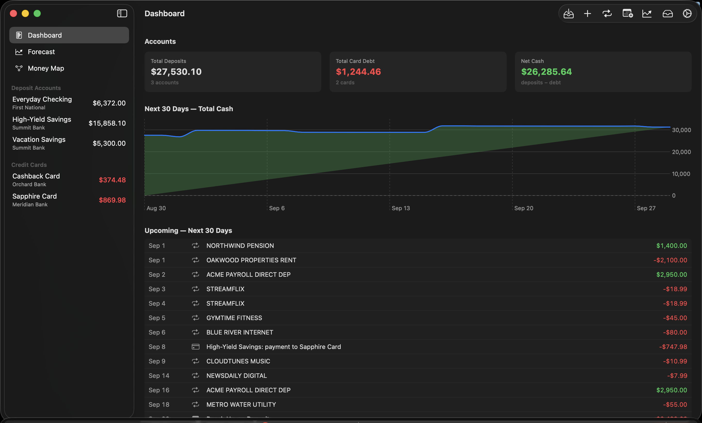

---

## 2. First launch

There is no setup wizard — the app opens straight onto the **Dashboard** with an empty sidebar. Your first-run path is:

1. **Add your accounts** (section 4).
2. **Import statements** into them (section 5).
3. **Review what the app detected** — recurring bills and income (section 6), transfer matches (section 8).
4. **Set up your rules** — card autopay, transfers, thresholds (section 10).
5. **Read the Forecast and Money Map** (sections 11–12).

### iCloud

If you're signed in to iCloud, sync is automatic — there's nothing to configure. If not, a yellow banner appears at the top of the window:

> **iCloud is not signed in** — *Your data is local-only on this device until you sign in to iCloud.*

Everything still works; you just won't have cross-device sync or the iCloud copy of your data. Other banner variants ("restricted", "sync unavailable") mean the same thing: the app is running locally.

### The window

- The **sidebar** lists three views — **Dashboard**, **Forecast**, **Money Map** — followed by your **Deposit Accounts** and **Credit Cards** with live balances.
- The **toolbar** (top right) holds seven buttons: **Import**, **Add Account**, **Recurring**, **Future Events**, **Forecast**, **Inbox**, and **Settings**. Hover any of them for a description.

---

## 3. The Dashboard

The Dashboard is the at-a-glance overview:

- **Accounts tiles** — *Total Deposits* (all checking + savings), *Total Card Debt* (what you owe across cards, always shown as a positive number), and *Net Cash* (deposits − debt).
- **Next 30 Days — Total Cash** — a chart of your projected combined cash. Green above zero, red below.
- **Upcoming — Next 30 Days** — a dated list of every projected event in the next month: recurring bills and income, future events you've planned, and card payments, with a net inflow/outflow total at the bottom.

If the forecast projects trouble, an orange **shortfall banner** appears above every screen:

> **N projected shortfalls in the next 90 days — open Forecast to review**

followed by the first few, each as a date, an amount, and the account. **The banner is a button** — click it to jump to the Forecast. This banner is the app tapping you on the shoulder; section 11 explains how to read what it's telling you.

---

## 4. Accounts

### Adding an account

Click **Add Account** in the toolbar.

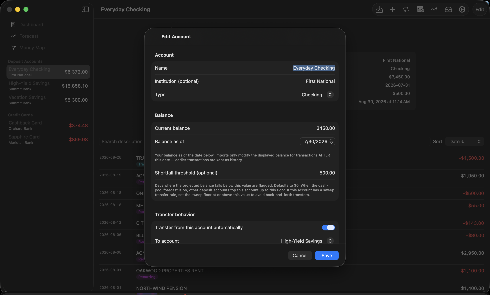

- **Name / Institution / Type** — type is *Checking*, *Savings*, or *Credit Card*.
- **Balance** — this is the **anchor balance**, the single most important number you'll enter:
  - For a deposit account: your balance right now.
  - For a credit card: **what you owe right now, entered as a positive number.**
- **Balance as of** — the date that balance was true.

The anchor is the fixed point every projection hangs from. Imports only affect the displayed balance for transactions dated *after* the anchor date — older transactions become history without disturbing the number you anchored.

- **Shortfall threshold** (deposit accounts only) — the floor you never want this account to drop below. Days where the projection falls under it are flagged, and — once you know about the cash pool (section 10) — this is also the level other accounts will top this one up to. Defaults to $0.

Two more sections appear depending on account type — **Payment behavior** for cards and **Transfer behavior** for deposit accounts. They're the heart of the "mappings" and get their own section (10). You can skip them while first setting up and come back.

### The account page

Click any account in the sidebar:

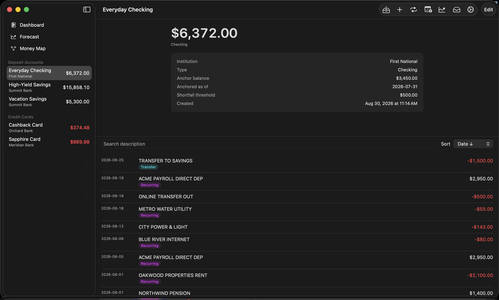

- The big number is the current balance (for cards: **amount owed**, red when nonzero).
- An info panel shows institution, type, anchor balance and date, threshold, and creation date.
- Below the divider: every transaction, with a **search field** and a **Sort** menu (Date/Amount, ascending/descending). Each row can carry badges:
  - **FITID** — carries the bank's unique transaction ID (best-quality dedup)
  - **Recurring** — belongs to a detected recurring series
  - **Transfer** — linked to its matching transaction in another account
  - **QFX / CSV / …** — the file format it was imported from
- Right-click any transaction for **"Link to transfer…"** / **"Unlink transfer"** (section 8).
- **Edit** (top right) reopens the account form.

To **delete** an account, swipe left on it in the sidebar. Deleting removes the account *and all its transactions* — the app asks first, and it cannot be undone.

---

## 5. Importing statements

Click **Import** (enabled once at least one account exists).

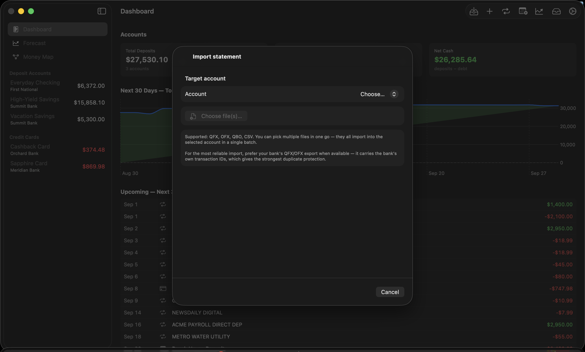

1. Pick the **target account**.
2. Click **Choose file(s)…** — you can select several files at once; they all import into that account as one batch.

**Supported formats:** QFX, OFX, QBO, and CSV. Every bank offers at least one of these — look for "Download" or "Export" on your statement or activity page, and prefer QFX/OFX when offered (it carries the bank's own transaction IDs, which gives the strongest duplicate protection).

### The preview

Nothing is written until you approve. The preview shows a summary (date range, total rows, clean vs duplicates), any parser warnings, and every transaction with a classification:

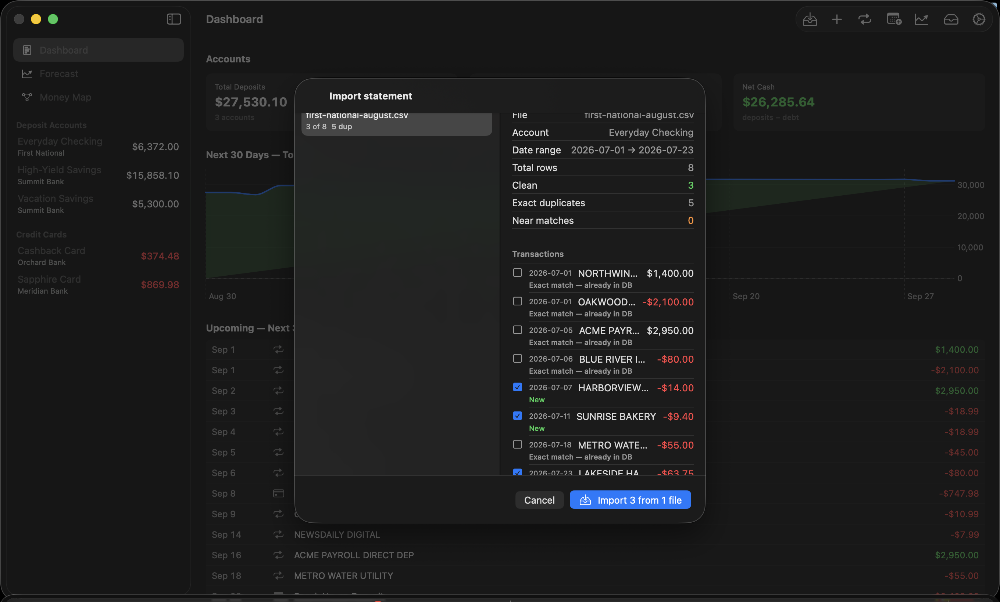

- **New** (green) — will be inserted.
- **Exact match / Exact match (FITID)** — already in the database; defaults to *skip*.
- **Same date + amount as existing — likely duplicate** (orange) — defaults to *skip*.
- **Near match** (orange) — similar but not identical; defaults to *insert*.

Every row has a checkbox — override any decision by clicking it. If you've imported this exact file before, a notice says so (per-row dedup still protects you if you proceed). Then click **Import N** and confirm.

### What happens automatically after an import

Three things run on every import, with no action needed from you:

1. **Transfer linking** — unambiguous cross-account pairs (like a card payment leaving checking and arriving on the card) are linked automatically. Ambiguous ones go to the **Inbox** for your review.
2. **Recurring detection** — repeating patterns become recurring series (section 6).
3. **Future-event reconciliation** — if an imported transaction matches a future event you'd planned (within 3 days and $1 or 1%), the event is marked reconciled so it isn't double-counted.

Made a mistake? **Settings → Import history** has an **Undo** button per import session that removes exactly the rows that import inserted.

---

## 6. Recurring series — teaching the app your rhythm

Open **Recurring** in the toolbar, then click **Run detection** (detection also runs after every import). Anything that repeats on a steady cadence — weekly, biweekly, monthly, quarterly, or annual — becomes a **series**.

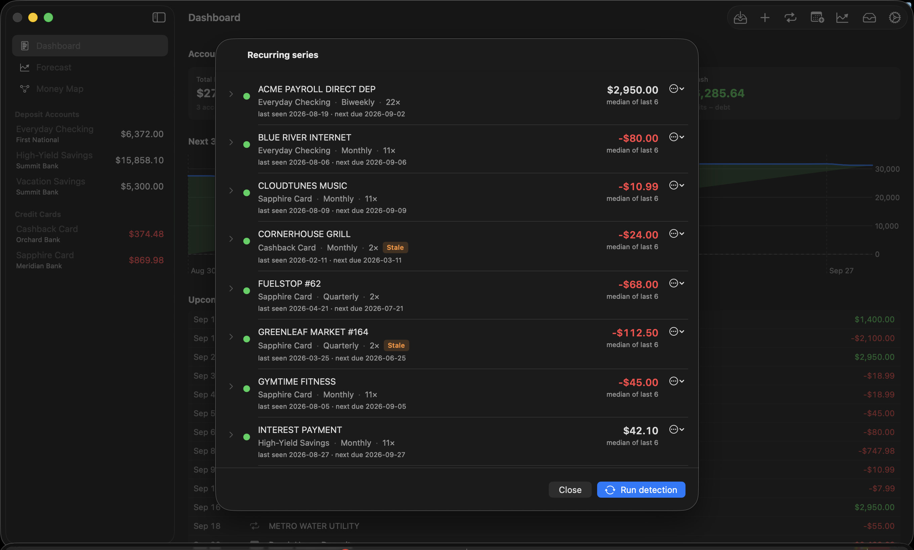

Each series has a colored dot, and the color determines whether it's projected in your forecast:

| Dot | Meaning | Projected? |
|---|---|---|
| 🟡 **Yellow** | Detected, awaiting your confirmation | Only if you flip the Forecast's "Include yellow series" toggle |
| 🟢 **Green** | Confirmed by you (or seen often enough to auto-promote) | **Yes** |
| ⚪ **Gray** | Dismissed by you | Never |

**This review is the highest-leverage ten minutes in the app.** Go down the list:

- Real bills and subscriptions → **Confirm**.
- **Your income too!** Paychecks, Social Security, pension, regular brokerage deposits — confirm them. *Income only enters the forecast through confirmed series and planned future events.* If your paycheck sits unconfirmed at yellow, the forecast sees no income and everything looks dire.
- Coincidences and one-offs → **Dismiss** (recoverable later via **Restore**).

Each row shows the account, cadence, occurrence count, last-seen and next-due dates, and the **projected amount** — computed from history (average of monthly averages with a year of data; median of the last six otherwise; outliers trimmed). The **⋯ menu → "Edit override amount…"** lets you pin a fixed amount instead — useful when you know a bill is changing, or to set a brokerage draw to what you actually take monthly.

A series that stops appearing in your imports eventually gets an orange **Stale** badge and quietly stops projecting — dead subscriptions don't haunt your forecast forever.

---

## 7. Future events — things you know are coming

Recurring detection only knows the past. For everything you *know* is coming that history can't show — a trip's final payment, an annual insurance premium, an expected bonus, a planned brokerage withdrawal — open **Future Events** and click **Add Future Event**.

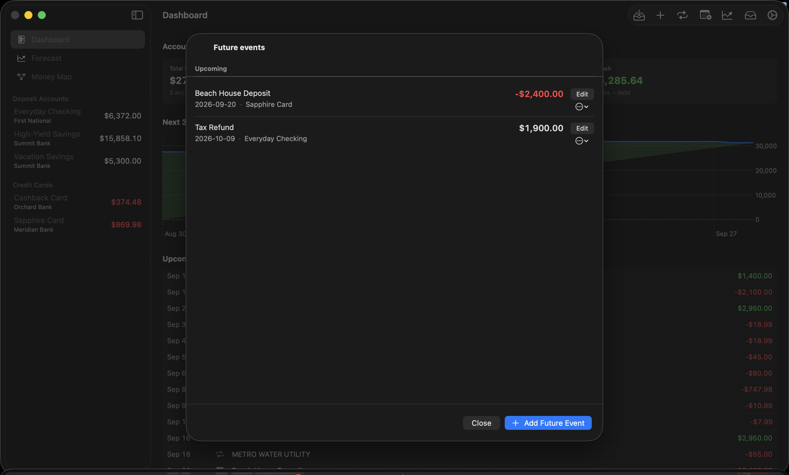

- **Amount is signed**: positive = income, negative = expense.
- **Account**: assign the event to the account (or card) it will hit, or leave it **Unassigned** to affect only the total-cash line.
- **Recurrence**: events can repeat (weekly through annually) with an end date or a count — handy for "$3,000 from the brokerage on the 20th of each month for the next 6 months."

Events show as *Upcoming*, then either become **Reconciled** automatically when a matching transaction is imported, or *Overdue* if the date passes with no match — your cue that the expected thing didn't happen.

**Planned income belongs here.** If you cover gaps with irregular brokerage withdrawals, entering them as dated future events is how the forecast learns the cavalry is coming.

---

## 8. The Inbox — reviewing the app's guesses

The **Inbox** collects everything the engine found but wasn't sure enough to act on alone:

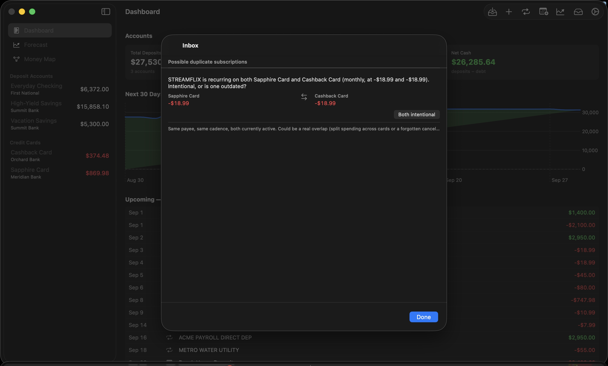

- **Transfer-link candidates** — pairs of transactions in different accounts with matching dates (±3 days) and amounts (within 1%) that *look* like the same money moving. **Link** connects them (they'll net to zero in total cash instead of counting twice); **Dismiss** hides the suggestion for this session.
- **Possible duplicate subscriptions** — the same payee recurring twice at the same cadence (two Netflix charges on different cards, or a $15 → $23 plan change). If both are real, click **Both intentional** and the pair never resurfaces; if one is outdated, dismiss that series in the Recurring list.

You can also link transfers manually: right-click any transaction → **Link to transfer…** and pick its counterpart.

Why linking matters: a card payment is one $500, not two. Linked pairs are excluded from spending averages and net out in totals — unlinked, they'd double-count.

---

## 9. How the forecast thinks

Everything above feeds one engine. For every account, for every day of the horizon, it applies — in order:

1. **Recurring series** (green, plus yellow if toggled) on their cadence.
2. **Everyday spending** — the *discretionary baseline*: for each account, the average month of spending that *isn't* recurring, a transfer, or a planned event, computed from your last six full months with the highest one or two months dropped (so a vacation doesn't get baked in as "normal"). Applied as a smooth daily amount. Outflows only, deliberately — a lucky one-off deposit never inflates projected income.
3. **Future events** on their dates.
4. **Transfer rules**, then **card payment rules** (section 10).
5. **The cash pool** (section 10) — money moves to where it's needed.

Because the baseline recomputes from a rolling window on every refresh, the forecast **self-corrects**: an unusually expensive spring fades out of the numbers over the following months, no cleanup required.

---

## 10. The mappings — wiring money the way you actually run it

This is the heart of BaselineLab. Three kinds of rules, all edited in each account's form (**Edit** on the account page), plus one app-wide setting, teach the forecast your plumbing.

### Card payment rules — *"this card gets paid from that account"*

On each credit card's form, under **Payment behavior**:

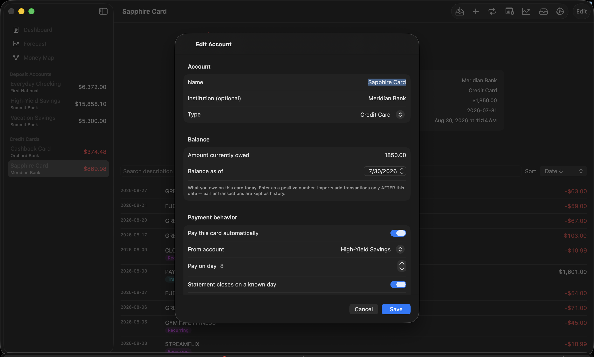

- **Pay this card automatically** — turn it on.
- **From account** — the deposit account your autopay pulls from.
- **Pay on day** — the day of month the payment lands (1–28).
- **Statement closes on a known day** — your card's cycle closing day (from any statement). Used by the "Pay statement balance" forecasting mode, below.
- **Strategy** — *Statement balance* (pay what's owed — most people's autopay), *Fixed amount*, or *Minimum (percent)* with a $25 floor.
- **Cap payment by available funds** — leave this **on**. It's what makes shortfalls visible: when the source account can't cover the payment, the forecast pays what it can and *warns you about the gap* instead of pretending.
- **Minimum reserve on source** — optionally keep a floor on the funding account that payments never drain below.

### Payment timing — *"but charges after the closing date aren't due yet"*

**Settings → Forecasting → Card payments** offers two models:

- **Pay full balance on due day** (default) — each projected payment clears everything owed that day. Conservative: cash leaves about one statement cycle early, so warnings run early rather than late.
- **Pay statement balance** — payments cover only the balance as of each card's closing day; later charges roll to the next cycle, exactly like real autopay. The card carries its realistic floating balance. Requires the closing day to be set per card (cards without one keep the conservative behavior).

### Transfer rules — *"I move money from here to there on schedule"*

On each deposit account's form, under **Transfer behavior**:

- **Transfer from this account automatically**, a **To account**, and a **day of month**.
- Strategy **"Everything above a floor"** (a *sweep* — moves whatever sits above the floor; self-adjusting as income drifts; the right choice for "my income lands in checking, I move it to savings") or **"Fixed amount"**.

Transfers fire *before* card payments on the same day, so a sweep into your payment account funds that day's autopay.

### The cash pool and thresholds — *"money goes wherever it's needed"*

Real households don't let one account starve while another has plenty — when an account runs low, you top it up from wherever the money is. The forecast models exactly that. With **Cash pool** on (it's on by default, toggleable in the Forecast view):

- Every deposit account has a floor — its **shortfall threshold**.
- When an account is about to drop below its floor (a bill hits, or a card payment comes due against it), the pool tops it up from other accounts' surplus, largest surplus first. These moves appear in the forecast as *pool transfers*.
- **When the whole pool can't cover a need, that's a real shortfall** — a dated, quantified *"you will need $X more by DATE"* signal.

**Give each account an honest threshold** (the "keep at least this much here" number). You can set it in the account form, or live in the Forecast view: select an account in the View picker and the Threshold field edits that account's floor directly.

### A worked example

Income lands in **Checking** on the 3rd and 17th. Four cards autopay from **Savings** on the 8th and 28th. You keep about $2,000 in checking and sweep the rest:

1. Each card: *Payment behavior* → paid automatically, from **Savings**, statement balance, cap on, closing day set.
2. Checking: *Transfer behavior* → transfer automatically to **Savings**, day 20, "Everything above a floor," keep **$2,000**.
3. Checking threshold $500, Savings threshold $1,000 — the pool holds both there if it can.
4. Settings → Forecasting → **Pay statement balance**.

Now the forecast mirrors your real life: income pools into savings, cards get paid on real timing, accounts hold their floors — and the moment the *whole system* can't cover something, you get a date and a dollar amount.

---

## 11. The Forecast

Select **Forecast** in the sidebar.

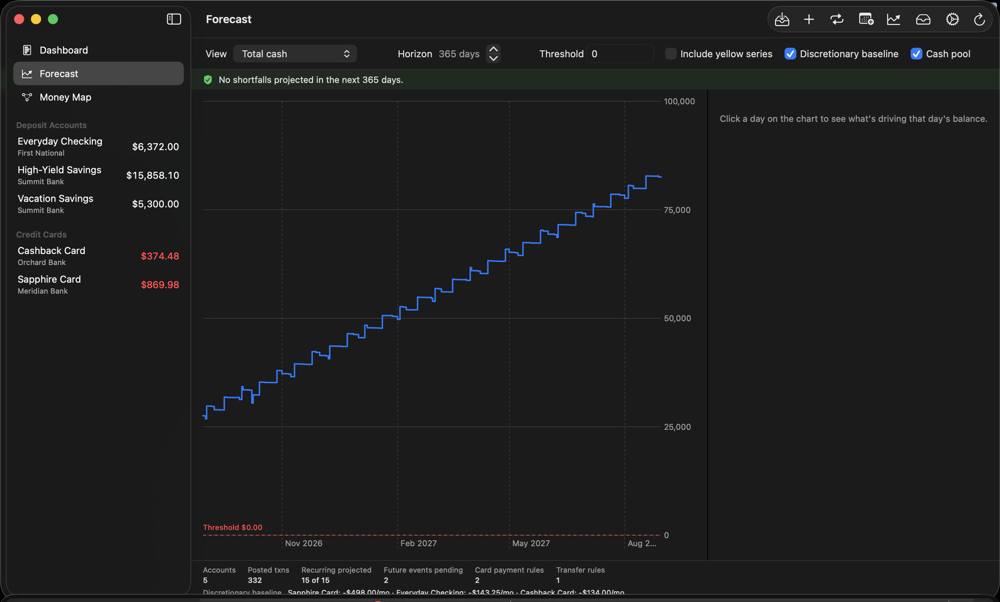

**Controls, left to right:**

- **View** — Total cash, All accounts overlay, or any single account.
- **Horizon** — 30 days to 5 years.
- **Threshold** — with a single account selected, this shows **and edits** that account's shortfall threshold (saved to the account, drives the pool). On Total cash / overlay it's just a reference line.
- **Include yellow series** — project unconfirmed recurring series too.
- **Discretionary baseline** — include everyday spending (on by default; the footer shows each account's computed monthly rate so you can sanity-check it).
- **Cash pool** — the money-moves-where-needed behavior (on by default; turn it off to see each account fend for itself).

**Reading the chart:**

- **Hover** anywhere for a dashed day-line and a floating readout with the date and exact balance — on the all-accounts overlay it lists every account's balance for that day.
- **Click a day** to pin the **contributors panel**: every projected item landing that day — bills, income, card payments in/out, pool transfers, ongoing-spend totals — each with a colored badge. This answers "why does the line move here?"
- With a single account selected and no day pinned, the panel lists all of that account's upcoming contributors chronologically.

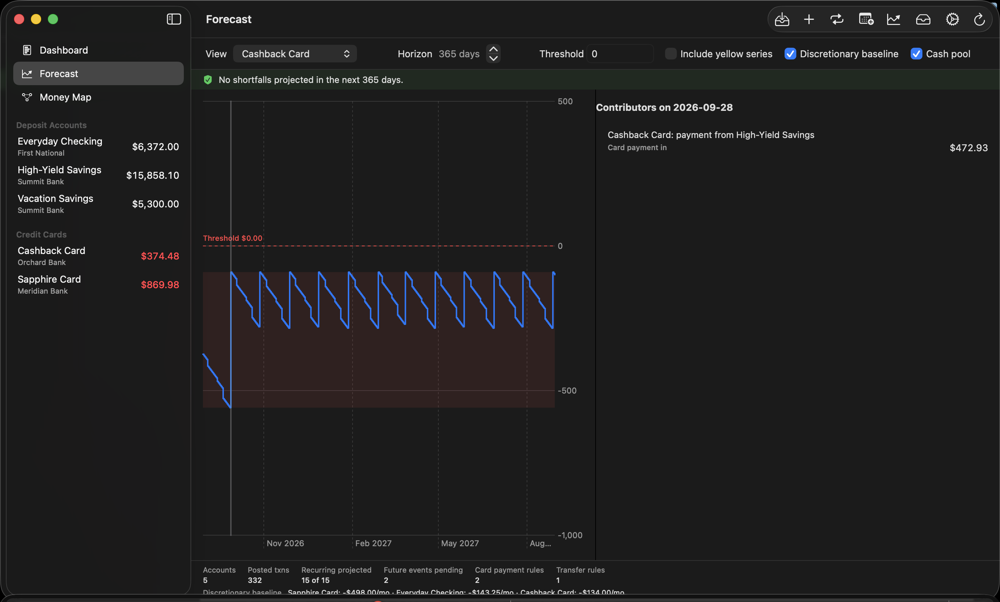

**The risk banner** across the top counts the projected shortfalls in the horizon and lists the first few. Two kinds appear:

- **Card-payment shortfall** — on a payment day, even after pooling every available dollar, the payment couldn't be made in full. The amount is the gap.
- **Pool shortfall** — an account needed a top-up and the whole pool was short. The label reads like the action item it is: *"need $X more by DATE (total $Y)"*, at most one per account per month.

**These entries are the point of the app.** Read them as your funding to-do list: *arrange $X of new money — a brokerage draw, whatever your source is — before this date.* **Jump to first** takes the chart there. When the banner is green ("No shortfalls projected"), your plan covers the horizon.

Numbers under the chart show what fed the forecast: accounts, transactions, how many series projected, pending events, rules, and the per-account everyday-spend rates.

---

## 12. The Money Map

Select **Money Map** in the sidebar — the whole system on one screen:

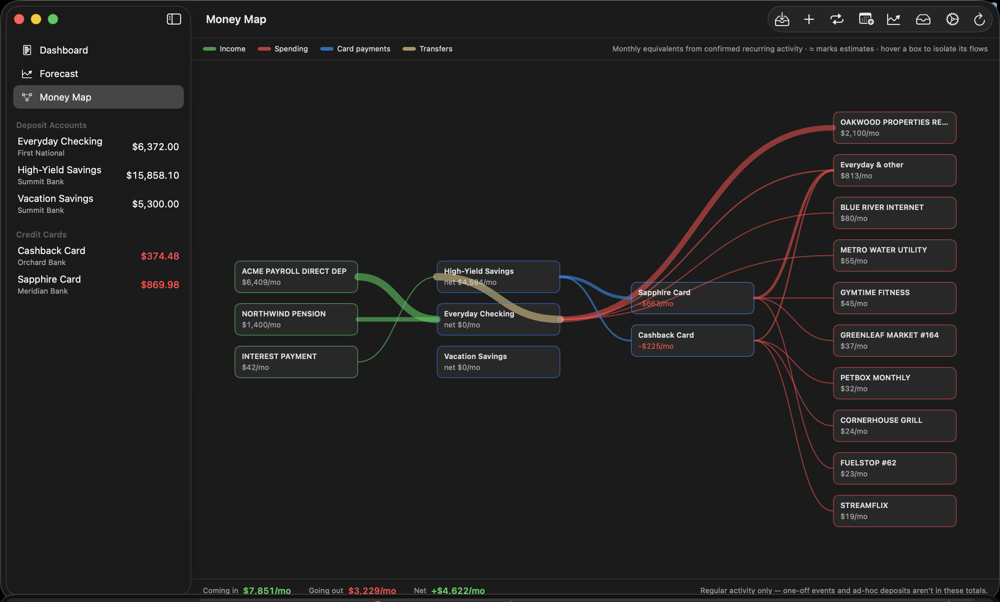

Four columns, connected by flowing bands whose **thickness is proportional to monthly dollars**:

| Column | Contains |
|---|---|
| **Income sources** | Everyone who regularly pays you |
| **Deposit accounts** | Checking and savings, each showing its net monthly flow |
| **Credit cards** | Each card, showing its monthly burn |
| **Spending** | Your top payees per account, plus one "Everyday & other" box for everything smaller and day-to-day spending |

Colors: **green** = income · **red** = spending · **blue** = card payments · **straw yellow** = transfers/sweeps.

- **Hover any box** to isolate it — unrelated flows fade, and a readout lists every flow touching that box with exact monthly amounts and rule details ("Autopay day 8 · statement closes day 20 · ≈ $663/mo"). The **≈** marks estimates — sweeps and statement-balance autopays don't have a fixed amount, so the map shows what they average.

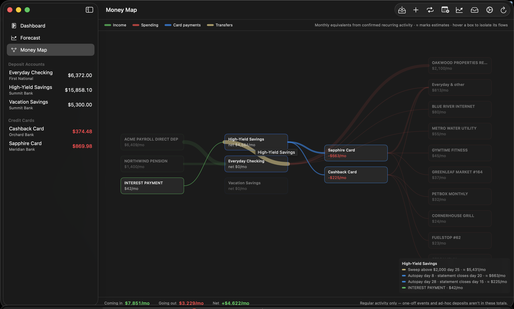
- The **bottom bar** is the punchline: **Coming in** vs **Going out** per month, and the **Net**. Regular activity only — one-off events and unplanned deposits aren't in these totals.

All numbers are monthly equivalents of your *confirmed* recurring activity plus everyday-spend averages — the same math as the forecast, drawn as a picture.

---

## 13. Keeping your data safe

- **iCloud sync** — automatic when signed in; your private database, no third parties.
- **Automatic local backups** — once a day at launch, the app writes a full export (per-account CSVs + a complete JSON snapshot) into its own storage, keeping the last seven. Silent and automatic.
- **Manual export** — **Settings → Backup → Export everything…** writes that same timestamped folder anywhere you choose (an external drive is a fine idea). This is your portable, iCloud-independent backup.
- **Undo an import** — Settings → Import history → **Undo** removes exactly that session's rows.
- **Danger zone** — deletes all *imported* data while keeping accounts and anchors, for starting history over.
- **Version guard** — if you ever launch an outdated copy of BaselineLab against a database a newer version has upgraded, the old copy refuses to open it (with a clear message) rather than risk damaging it. Keep one copy of the app installed, and always run the newest.

---

## 14. Troubleshooting

**"Everything slides to zero!"** — Almost always missing income. Open Recurring and confirm your paycheck/deposit series (yellow doesn't project). If you fund gaps with irregular withdrawals, add them as Future Events or set an override on the deposit series.

**"An account slides even though the household has money."** — The Cash pool toggle is off, or the account's threshold is unset. With pooling on and honest thresholds, accounts hold their floors and only *real* household-level gaps get flagged.

**"The forecast says I'm overspending."** — It might be right; that's the job. Check the per-account *Ongoing spend* rates in the Forecast footer against your instincts. The window is your last six months (highest 1–2 dropped) and self-corrects as unusual months age out. The shortfall entries tell you exactly how much to arrange, by when, in the meantime.

**"A bill/subscription shows twice."** — Check the Inbox for a duplicate-subscription flag; dismiss the outdated series in Recurring. For rows imported twice via different formats, run **Settings → Find cross-format duplicates…**.

**"A transfer or card payment counts as spending."** — The two sides aren't linked. Check the Inbox for the candidate pair, or right-click the transaction → **Link to transfer…**. **Settings → Audit existing transfer links…** reviews links already made.

**"My card's projected payment is bigger than my statement."** — You're in the default "pay full balance" mode, which pays everything owed on the due day. Switch Settings → Forecasting to **Pay statement balance** and set each card's closing day for real-world timing.

**"It says this copy of BaselineLab is out of date."** — You launched an older copy of the app than the one that last touched your data. Find and launch the newest copy; delete stale ones.

---

## 15. Glossary

| Term | Meaning |
|---|---|
| **Anchor balance** | The known-true balance (and date) each account's projection is built from |
| **Recurring series** | A detected repeating transaction pattern; 🟡 unconfirmed / 🟢 confirmed / ⚪ dismissed |
| **Discretionary baseline** | An account's average month of non-recurring spending ("Ongoing spend"), applied daily |
| **Future event** | A dated income or expense you plan manually; reconciles automatically when it arrives |
| **Transfer link** | Two transactions marked as the same money moving between accounts |
| **Card payment rule** | The autopay mapping: which account pays a card, when, and how much |
| **Statement closing day** | The day a card's cycle closes; enables realistic payment timing |
| **Transfer rule** | A scheduled move between deposit accounts — a fixed amount or a sweep-above-floor |
| **Shortfall threshold** | An account's floor: flag level and cash-pool top-up target |
| **Cash pool** | Forecast behavior where deposit accounts cover each other's needs before anything is called short |
| **Shortfall** | A dated, quantified projected gap the whole plan can't cover — your signal to arrange money |
| **Horizon** | How far ahead the forecast runs (30 days–5 years) |
| **Reconciled** | A future event matched to a real imported transaction |
| **Stale** | A series that stopped occurring and is no longer projected |
| **FITID** | The bank's unique transaction ID; the strongest duplicate protection |

---

*BaselineLab keeps your history honest, your projections skeptical, and your warnings early. The rest is up to you.*
